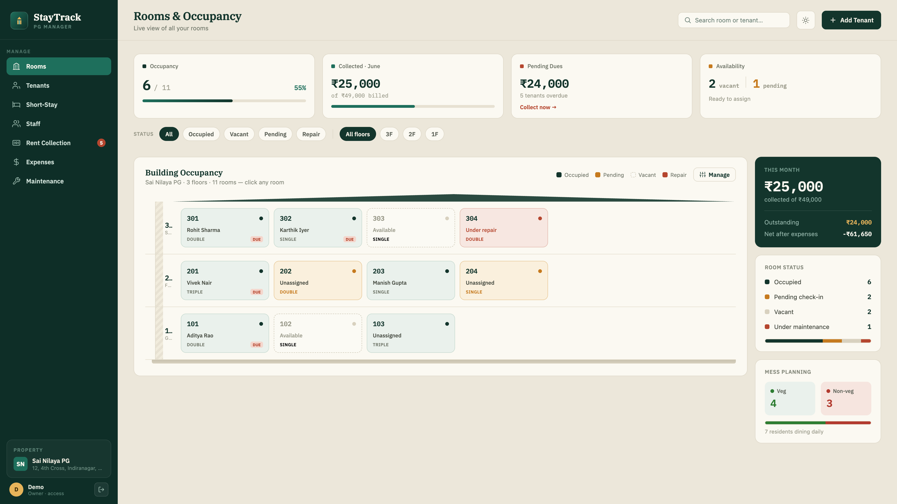
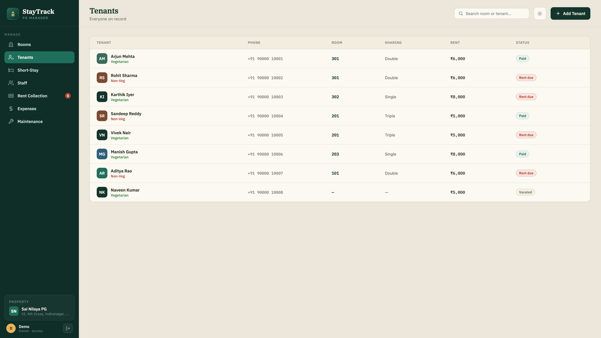
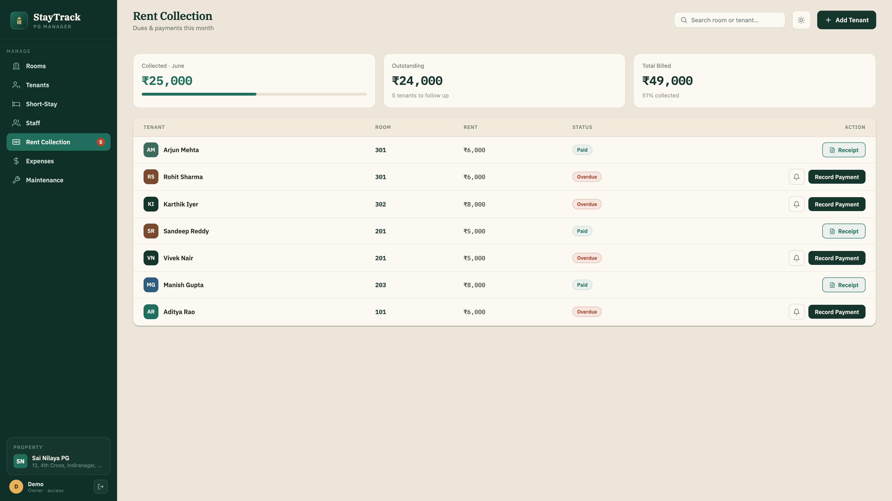
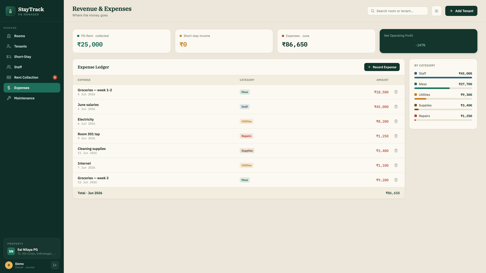
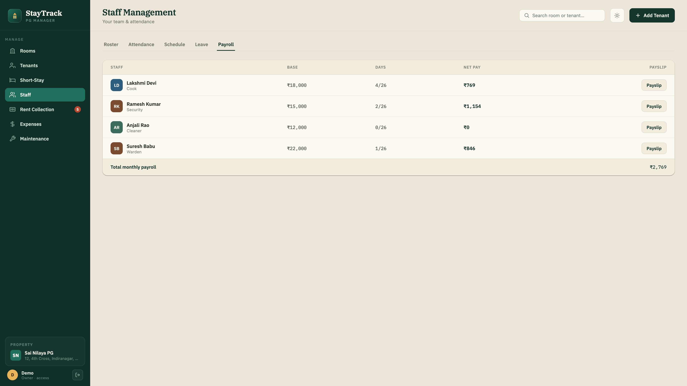
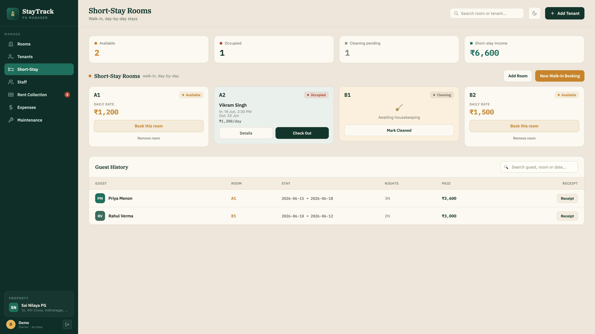
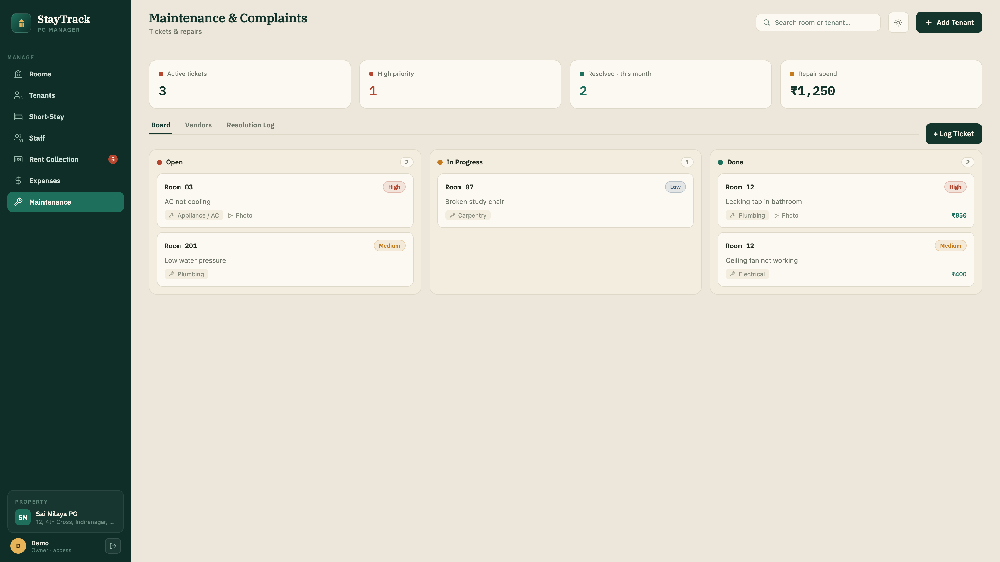
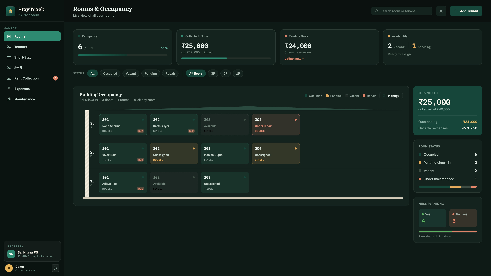
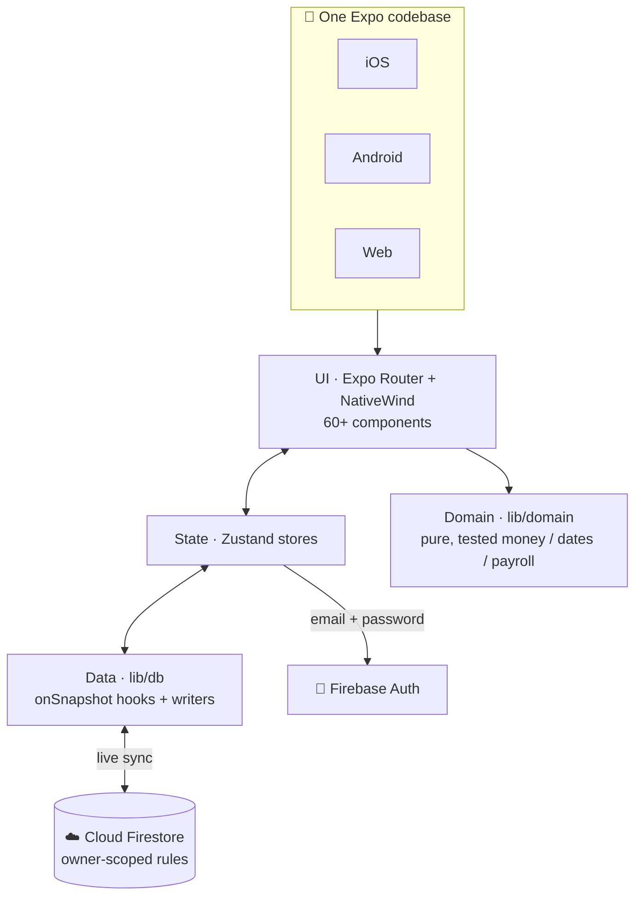

<div align="center">


# StayTrack

### Run your PG like a ledger, not a guessbook.

A cross-platform property-management app for **Paying-Guest (PG) owners** — rooms, tenants,
rent, staff, expenses and maintenance, all from **one codebase** that runs on iOS, Android & Web.

<br/>


**🌐 [Live app](https://staytrack-ca1ac.web.app)** (owner sign-in) &nbsp;·&nbsp; **📱 iOS · Android · Web** &nbsp;·&nbsp; **🎬 Remotion demo video in [`video/`](video/)**

<br/>



</div>

---

## Overview

**StayTrack** turns the spreadsheets-and-WhatsApp chaos of running a PG hostel into a single,
real-time app. A single owner manages one property end to end: who's in which bed, who owes rent,
what staff are owed, where the money went, and what needs fixing — across phone and web, always in sync.

It's a **production-grade, fully-typed React Native + Expo** app — a pixel-faithful native build of
a provided product design — with a tested domain layer, owner-scoped Firestore security, and exact
integer-paise money handling.

> **Explore it locally with seeded data (no login, no real backend):**
> ```bash
> npm install && cp .env.example .env && echo "EXPO_PUBLIC_DEMO=1" >> .env && npm run web
> ```
> Demo mode boots the real UI with realistic sample data and skips the sign-in screen.

### Contents

- [Features](#features)
- [Architecture](#architecture)
- [Engineering highlights](#engineering-highlights)
- [Tech stack](#tech-stack)
- [Getting started](#getting-started)
- [Testing](#testing)
- [Build & deploy](#build--deploy)
- [Project structure](#project-structure)
- [Demo video](#demo-video)

---

## Features

Seven modules, one codebase:

<table>
  <tr>
    <td width="50%" align="center" valign="top">
      <br/>
      <b>🏠 Rooms &amp; Occupancy</b><br/>
      <sub>Floor-by-floor building view with live occupancy, room status (occupied · vacant · pending · repair) and one-tap room/floor management.</sub>
    </td>
    <td width="50%" align="center" valign="top">
      <br/>
      <b>👤 Tenants</b><br/>
      <sub>A full tenant directory — room, sharing type, rent and payment status — with per-tenant profiles and KYC document storage.</sub>
    </td>
  </tr>
  <tr>
    <td width="50%" align="center" valign="top">
      <br/>
      <b>💸 Rent Collection</b><br/>
      <sub>Monthly dues per tenant, record payments by method, and generate printable receipts. Tracks collected vs outstanding vs billed.</sub>
    </td>
    <td width="50%" align="center" valign="top">
      <br/>
      <b>📊 Revenue &amp; Expenses</b><br/>
      <sub>A categorised expense ledger with a live net-operating-profit readout and a per-category spend breakdown.</sub>
    </td>
  </tr>
  <tr>
    <td width="50%" align="center" valign="top">
      <br/>
      <b>🧑‍🍳 Staff &amp; Payroll</b><br/>
      <sub>Roster, daily attendance, weekly schedule and leave — with auto-calculated payroll and printable payslips.</sub>
    </td>
    <td width="50%" align="center" valign="top">
      <br/>
      <b>🛎️ Short-Stay</b><br/>
      <sub>Day-by-day walk-in bookings with room availability, check-in/out, date &amp; time pickers and guest history.</sub>
    </td>
  </tr>
  <tr>
    <td width="50%" align="center" valign="top">
      <br/>
      <b>🔧 Maintenance</b><br/>
      <sub>A Kanban ticket board (open · in-progress · done), a vendor directory and a resolution log.</sub>
    </td>
    <td width="50%" align="center" valign="top">
      <br/>
      <b>🌗 Light &amp; Dark</b><br/>
      <sub>Every screen ships in a polished light and dark theme, with a fully responsive mobile-native layout.</sub>
    </td>
  </tr>
</table>

---

## Architecture

One Expo/React Native codebase compiles to all three platforms. UI state lives in Zustand;
data flows live from Firestore via `onSnapshot`; all business rules sit in a pure, unit-tested
domain layer.



---

## Engineering highlights

| | |
|---|---|
| ⚡ **Real-time by default** | Firestore `onSnapshot` streams straight into Zustand — every screen is always live, with bounded listeners and automatic cleanup. |
| 🔐 **Owner-scoped security** | Firestore rules lock every read and write to the signed-in user: `allow read, write: if request.auth.uid == uid`. |
| 🪙 **Exact money** | All amounts are stored as **integer paise**, so rupee arithmetic never drifts — formatting and conversion happen only at the edges. |
| ♻️ **Idempotent writes** | Deterministic document IDs (e.g. `tenantId_monthKey`) mean a retry or render race can never double-charge a tenant. |
| 🧪 **Tested core** | **44 Jest unit tests** across 10 suites cover the money, dates, payroll, dues and short-stay logic. |
| 🧱 **One codebase** | iOS, Android and Web from a single Expo app — no platform forks. |
| 🖨️ **Printable docs** | Native rent receipts and staff payslips render to print/PDF on web and mobile. |

---

## Tech stack

| Area | Choice |
|------|--------|
| **Framework** | [Expo](https://expo.dev) SDK 56 · [React Native](https://reactnative.dev) 0.85 · [Expo Router](https://docs.expo.dev/router/introduction/) (file-based) |
| **Language** | [TypeScript](https://www.typescriptlang.org/) |
| **Styling** | [NativeWind v4](https://www.nativewind.dev/) (Tailwind for RN) · `react-native-svg` · IBM Plex (Sans / Serif / Mono) |
| **State** | [Zustand](https://github.com/pmndrs/zustand) |
| **Backend** | [Firebase](https://firebase.google.com/) — Cloud Firestore, Auth, Hosting (JS SDK v10) |
| **Animation** | Reanimated 4 · Gesture Handler |
| **Testing** | [Jest](https://jestjs.io/) · `@testing-library/react-native` |
| **Demo video** | [Remotion](https://www.remotion.dev/) 4 (in [`video/`](video/)) |

---

## Getting started

**Prerequisites:** Node 18+ and npm. For native runs you'll also want Xcode / Android Studio, or the **Expo Go** app on your phone.

```bash
git clone https://github.com/Adith-Senthil-kumar/staytrack.git
cd staytrack
npm install
```

### Option A — explore with seeded demo data

No Firebase, no login — boots the real UI with realistic sample data:

```bash
cp .env.example .env
echo "EXPO_PUBLIC_DEMO=1" >> .env
npm run web
```

### Option B — run against your own Firebase

```bash
cp .env.example .env     # fill in your EXPO_PUBLIC_FIREBASE_* values
npm run web              # or: npm run ios  /  npm run android
```

Then, in the [Firebase console](https://console.firebase.google.com/):

1. Enable **Authentication → Email/Password**.
2. Create the **owner's account** under *Authentication → Users* — the app is login-only, there's no in-app sign-up.
3. Create a **Cloud Firestore** database and deploy the rules in [`firebase/firestore.rules`](firebase/firestore.rules).

> Firebase web config values are public client keys — security is enforced by Auth + Firestore rules, not by hiding them.

---

## Testing

```bash
npm test            # run the suite once (44 tests, 10 suites)
npm run test:watch  # watch mode
npx tsc --noEmit    # typecheck
```

The tests focus on the **pure domain layer** — Indian-format money (paise), date helpers, payroll,
dues generation and short-stay pricing — so the rules that matter are verified independently of the UI.

---

## Build & deploy

| Target | Command |
|--------|---------|
| **Web** | `npx expo export -p web` → deploy `dist/` to any static host (the live app runs on **Firebase Hosting**) |
| **Android APK** (preview) | `eas build -p android --profile preview` |
| **Production** (iOS + Android) | `eas build --profile production` |

---

## Project structure

```
StayTrack/
├── app/                 # Expo Router screens (file-based routing)
│   └── (app)/           # rooms · tenants · rent · expenses · staff · short-stay · maintenance
├── components/          # 60+ UI components (dashboard, rent, staff, shell, ui, …)
├── lib/
│   ├── db/              # Firestore refs, onSnapshot hooks & writers
│   ├── domain/          # pure business logic — money (paise), dates, payroll, dues
│   ├── receipt/         # printable PDF receipts & payslips
│   ├── auth/  ui/  dev/ # auth helpers · UI utils · seeded demo data
│   └── storage/
├── store/               # Zustand stores (auth, confirm, …)
├── types/               # shared TypeScript types
├── firebase/            # Firestore security rules + indexes
├── __tests__/           # 44 Jest unit tests (10 suites)
└── video/               # Remotion portfolio video (separate npm project)
```

---

## Demo video

A 37-second product walkthrough is built with **Remotion** and lives in [`video/`](video/) — a real
tour of all seven modules, the engineering internals (with verbatim code), a tech-stack montage and
a light/dark theme reveal. The render output is gitignored; produce the MP4 with:

```bash
cd video
npm install
npx remotion render StayTrack out/staytrack-demo.mp4
```

---

## License

Released under the [MIT License](LICENSE) © 2026 Adith Senthil Kumar.

---

<div align="center">
<sub>Designed &amp; built solo by <b>Adith</b> · <a href="https://adith-senthil-kumar.github.io/my-portfolio/">Portfolio</a></sub>
</div>
